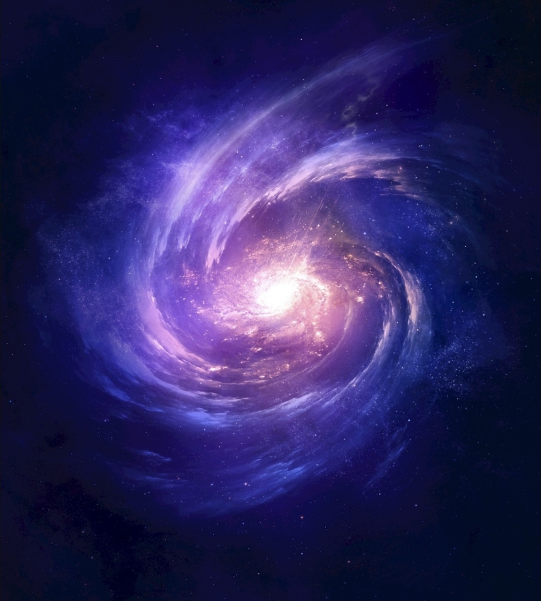
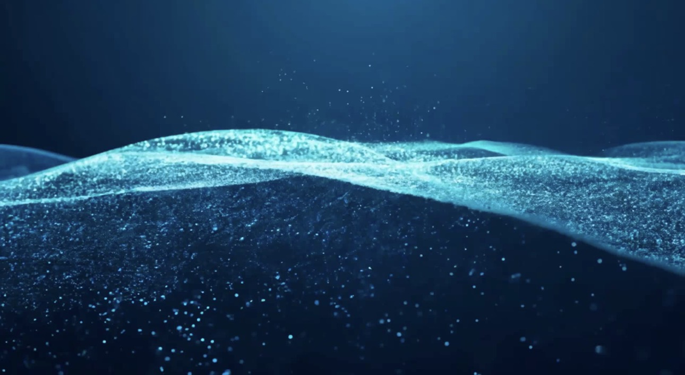

# Quiz 8 - Design Research

## Part 1: Imaging Technique Inspiration

The imaging technique I find inspiring is **particle flow simulation**, seen in NASA nebula photography and the film *Interstellar*. Countless tiny particles drift, gather, and disperse freely, symbolising the freedom and infinity of the universe. This technique captures a sense of boundless space and cosmic scale, which aligns with my assignment's theme of independence and movement. The fluid, organic motion of particles creates a visually dynamic and emotionally expressive result that I aim to incorporate into my project.

## Part 2: Coding Technique Exploration

A p5.js particle system can help achieve this effect. Each particle is an object with its own position, velocity, and colour, updated every frame to simulate fluid cosmic motion. Using `noise()` for movement creates organic, flowing paths rather than rigid lines. Mouse interaction can attract or repel particles, adding interactivity. This technique directly supports the visual goal of free-flowing, dynamic motion inspired by the nebula and universe theme above.

[Example Code – p5.js Particles](https://p5js.org/examples/simulate-particles/)